= Fungikey v0.4 =
:author: Groupe fungikey
:revnumber: v0.2
:revdate: 2022-10
:lang: fr
:doctype: book
:encoding: utf-8
:ascii-ids:

== Titre du projet : Application mobile autour des champignons. ==

image::logo.png[]

=== Membres de l'équipe ===
* AOUSSAR Assem
* BAYO Kemokoba
* El FACHATI Omar
* OULD AHMED Ghenima
* KONATE Mohamed

Présentation : (contexte, problématique et gain attendu, motivation de l'équipe par rapport au sujet, concurrence / état de l'art de l'existant et placement par rapport à cela). 

Le contexte de ce produit est une UE projet DevOps, à objectif professionnalisant et méthodologique au sein du Master 1 MIAGE à l’Université de Paris Nanterre. Ce projet se déroule sur 2 ans et a pour but de rendre un produit de qualité, avec documentation et plusieurs itérations avec des versions à rendre chaque semestre. L’application demandée est destinée à être utilisée par des étudiants en pharmacologie, des passionnés de fongiques et tout simplement un public général, avec des supports type smartphone (Android, iOS). L’application devra également être autonome, c’est-à-dire utilisable sans connexion, et permettra aux utilisateurs d’apprendre à identifier des champignons. Il n’y a pas de suite et maintenance prévue pour Fungikey 2024, ce dernier doit être déployable et utilisable à la fin de chaque itération. Cependant, l’application devrait pouvoir être maintenue, et le code lisible dans le cadre de la démarche qualité et professionnelle. Ce projet devra donc s’adapter aux besoins de l’utilisateur et à son environnement, pour étudier leurs instructions et les prendre en considération à chaque avancement. 

Il existe de nombreuses applications sur le marché dans le thème de la reconnaissance de champignons : Champignouf, Aux champignons, Picture Mushroom sont parmi les plus téléchargées sur le Play Store, chacun accumulant plus d'un million de téléchargements ; ils sont cependant axés pour des utilisateurs voulant cueillir des champignons, et non pour des étudiants. En effet, ces applications se concentrent plus sur une identification facile de champignons, comme par analyse d’image, plutôt qu’un fonctionnement par tableau avec des clés. Fungikey 2024 diffère par le contexte éducatif et académique : en effet, une petite partie de ces utilisateurs seront des étudiants en filière pharmacie. Ces derniers ont besoin d’apprendre à identifier des champignons, leurs familles, et à connaître leur toxicité, dans le cadre de leurs études. De plus, de nombreux champignons peuvent se ressembler, engendrant de possibles risques d'empoisonnement ; il faut alors une application permettant de les accompagner lors de TP où en forêt regroupant ces champignons dans leurs familles respectives, via leurs “clés”.

Persona et fonctionnalités de leur point de vue (haut niveau) : 

image::Photo1.jpg[]
image::Photo2.jpg[]

Prévisions marketing (comment prévoyez-vous de pousser votre projet auprès des utilisateurs, réseaux sociaux, enquêtes, flyers, site Web, etc) 

Prévision marketing :  

Réseaux sociaux :  Créer un compte Facebook et twitter pour mettre toutes les nouvelles annonces et mise à jour concernant l’application. 

Demander une permission aux mairies afin d’attacher des posters contenant un QR Code dans les parcs pour permettre à un nouveau public de s’intéresser à ce domaine. 

Contacter les départements scientifiques des facultés afin de proposer des partenariats pour que les étudiants et professeurs puissent en bénéficier. 

==== Partie 2 : Aspects techniques ==== 

Type d'application (web, mobile) : 

Le projet consiste à réaliser une application mobile sous forme de PWA.

Schéma architectural de l'application (front / API / back / persistance)

Plateforme technologique (langages utilisés, Frameworks de test, de lien métier/API, métier/persistance) :  

Cette application sera réalisée sous forme de Progressive Web App (PWA) afin d’avoir un déploiement plus simple, et permettre aux utilisateurs de télécharger et partager l’application rapidement. Technologies Web, qui serviront à construire le PWA : HTML, CSS, Javascript avec React JS et des libraries, Node Js. 

Langage utilisé : Javascript avec le framework ReactJS et des packages NodeJS et un peu de CSS.  

Plateforme opérationnelle (gestion de versions, build, qualité de code, CI, déploiement) : 

Pour ce projet, il conviendra d’utiliser Github. Il nous permettra de faire coexister différentes versions d’un même fichier, par conséquent, de mieux nous organiser dans ce travail en groupe. Visual Studio code, sera l’IDE qui nous permettrait de build notre code. En ce qui concerne le CI (Continuous intégration) nous allons utiliser Travis CI qui va nous permettre de tester notre application mobile et voir si chaque build de notre code se fait correctement (On pourra, notamment, le voir grâce à une balise présente sur le Github).

Interconnexion avec systèmes / API distantes (en prévision M1 semestre 2 et M2) 

Il conviendra d’utiliser l’API Google pour la localisation de l’utilisateur et pour cartographier les champignons sur une carte.  

Acquisition de données, usage intelligent des données (en prévision M2) 

-Référencement des champignons en fonction de la position.  

=== Partie 3 : Modélisation ===

Diagrammes de séquence des interactions front/back (par feature, voir le back comme une boîte noire) 

Arborescence du front : 

=== Les Releases ===

== Version 0.1 ==

Affichage d’un menu sur la page d’accueil de l’application qui contient quatre boutons : Identification, Conseils, Jeux et Avertissement 

On trouve aussi une photo du logo de l’application. 

Feature: Affichage d’un message d’avertissement qui renvoie vers le site de l’aness  

 

== Version 0.2: ==

Dans cette nouvelle version (0.2), on a ajouté quatre nouvelles fonctionnalités dont deux grandes et deux petites. 

- Première petite fonctionnalité : 

Amélioration de l’interface graphique  

 

- Deuxième petite fonctionnalité : 

Informations sur l’anatomie d’un champignon en général. 

Première grande fonctionnalité : Barre de recherche 

Une barre de recherche qui nous permet de rechercher un champignon spécifique en saisissant son nom au lieu de parcourir toute la liste des champignons 

- Deuxième grande fonctionnalité : Liste de champignons 

Une liste qui contient tous les champignons avec leurs images et caractéristiques. 

== Version 0.3 ==

Dans cette nouvelle version, de nouvelles fonctionnalités ont été ajoutés avec une amélioration des anciennes. 

- Première feature: L'identification des champignons. 

Cette fonctionnalité facilite la recherche d’un champignon en spécifiant ses critères, L'identificator permet aussi de rechercher un champignon en saisissant son nom. 

Et pas que ! il en choisissant les filtres, l'utilisateur va ensuite sélectionner pour chaque filtre le type du critère recherché : le type du chapeau par exemple. 

Donc cela permet vraiment à avoir une recherche très précise. 

Sur le menu principal on clique sur le bouton identification 

On sera redirigé vers une page qui nous donne des informations générales sur l’anatomie d’un champignon. En haut à droite, un bouton qui permet d’afficher une barre latérale qui contient des liens vers l’identificator et un raccourci pour les filtres disponibles sur ce dernier. 

Diagramme de séquence d'identification de champignons :

- Deuxième feature: Jeu champignons par famille:  

Ce quizz est conçu pour apprendre à identifier les champignons de manière ludique. 

Dans le menu sur la page d’accueil on clique sur le bouton “Jeux”. 

On sera redirigé vers une nouvelle page qui donne des explications sur le fonctionnement 

On clique alors sur la barre latérale droite puis on clique sur le lien qui porte le nom  du quizz  

Diagramme de séquence de jeu par famille :

- Troisième feature: Amélioration de la navigation (Barre latérale droite) 

Une barre en haut à droite de la page d’identification et jeux pour faciliter la navigation sur l’application. 

- Quatrième feature: Les filtres de recherche 

Sur la page d’identificator, on trouve plusieurs filtres qui facilitent la recherche de champignons au cas où on ne connait pas le nom de ces derniers 

- Diagramme de classe de la release :

=== Api ===
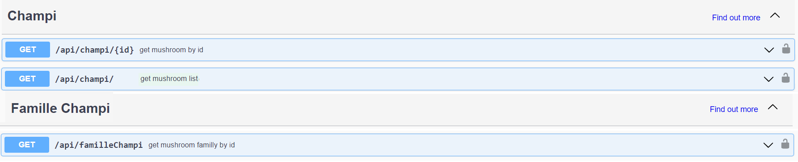

== Version 0.4 ==

Dans cette nouvelle version, nous avons eu a ajouté de nouvelles fonctionnalités ainsi que l'amélioration des anciennes. Nous avons notamment: 

- Première feature: Jeu par champignons:

Ce jeu est conçu pour apprendre à identifier les champignons de manière simple. 

Dans le menu sur la page d’accueil on clique sur le bouton “Jeux”. 

On sera redirigé vers une nouvelle page qui donne des explications sur le fonctionnement 

On clique alors sur la barre latérale droite puis on clique sur le lien qui porte le nom  du jeu en question. On pourra alors avoir un jeu assez basique qui genere diffenrt type de champigons et c'est à l'utilisateur de deviner le champignons.   

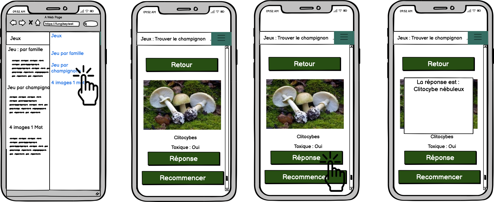

et son diagramme de classe et donc : 

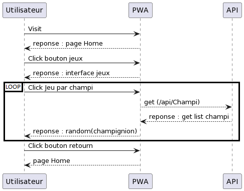

- Deuxième feature: Jeu 4 images 1 mot:

Ce jeu est conçu pour apprendre à identifier visuellement les champignons de manière simple. 

Dans le menu sur la page d’accueil on clique sur le bouton “Jeux”. 

On sera redirigé vers une nouvelle page qui donne des explications sur le fonctionnement 

On clique alors sur la barre latérale droite puis on clique sur le lien qui porte le nom  du jeu en question. On pourra alors avoir un choix de 4 images dont une seul est correcte. Si on appuis sur la fausse reponse, on obtinent un message d'erreur et dans le cas contraire, un message de félicitations. On a également la possibilité de recommencer.

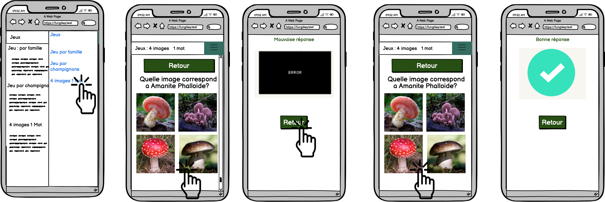

- Troisième feature: Afficher la liste complementaire des familles des champignons : 

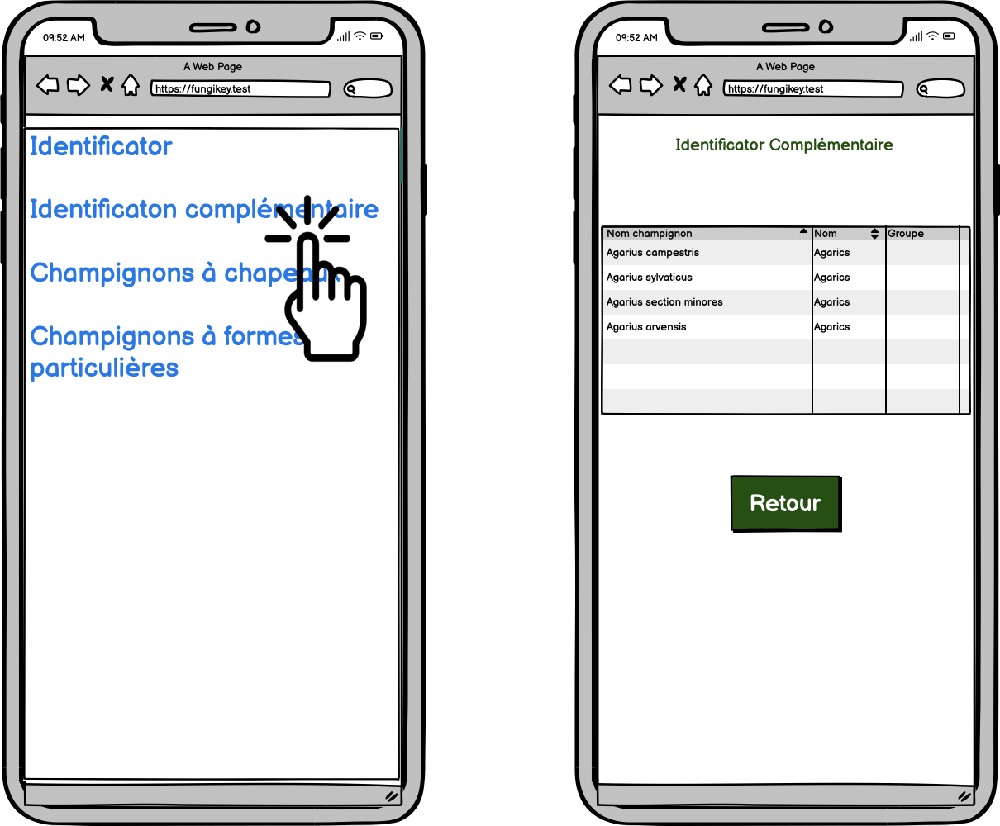

- Quatrième feature: Filtres de la recherche pour la liste des champignons complementaire :

Sur cette page, on a differents filtres qui permettent de faciliter la recherche en fonction de diffents critères

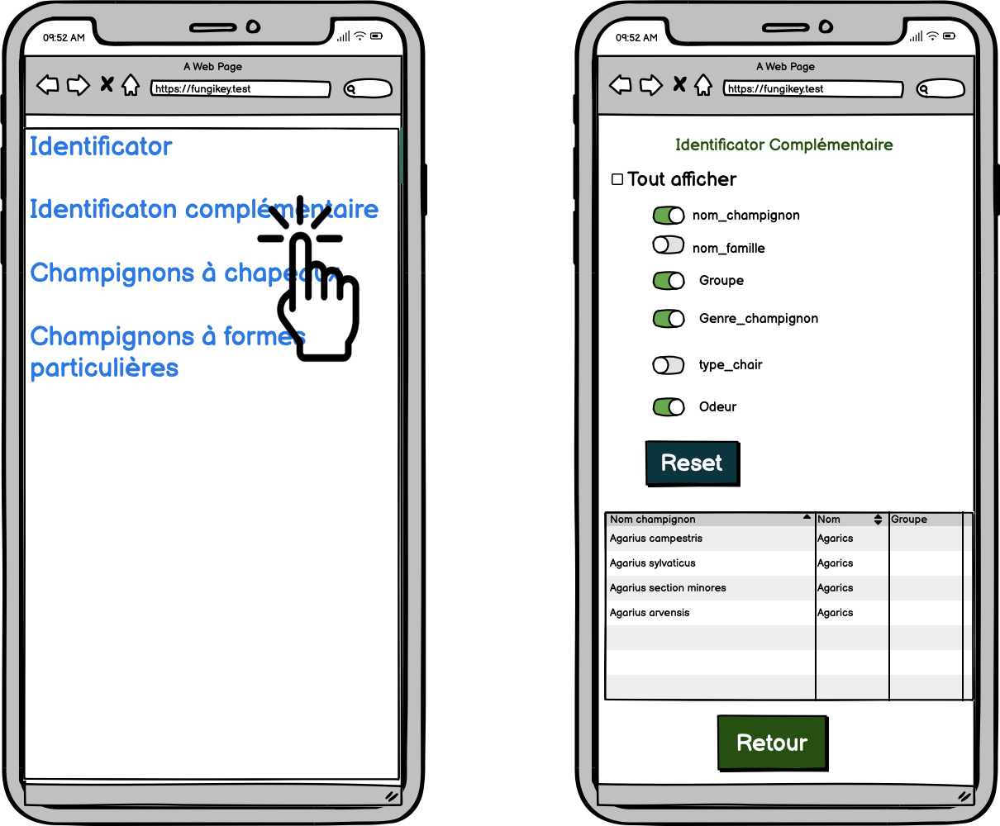

- Diagramme de sequence de l'indentificateur complementaire :

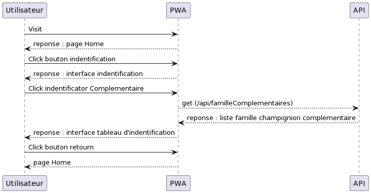

- Diagramme de classe de la release:

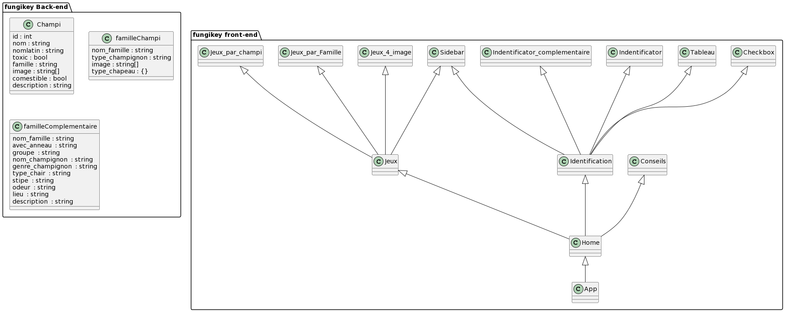

=== Api ===

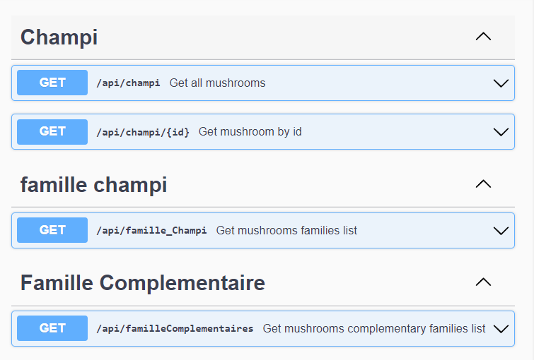

== Version 1.α ==

Dans cette nouvelle version, nous avons eu a ajouté de nouveau features ainsi que l'amélioration des anciennes. Nous avons notamment: 

- Première feature: Option de tri:

Cette fonctionnalité permet de connaitre son champignon à partir de son chapeau et par sa couleur

image::tri.png[]

- Deuxième feature: Recherche de champignons:

Elle permet d'effectuer la recherche de champignon selon la forme

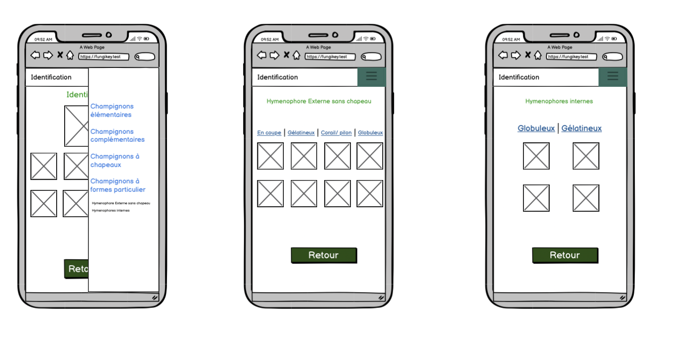

- Troisième feature: Les recettes : 

La présentation de recettes à partir de champignons

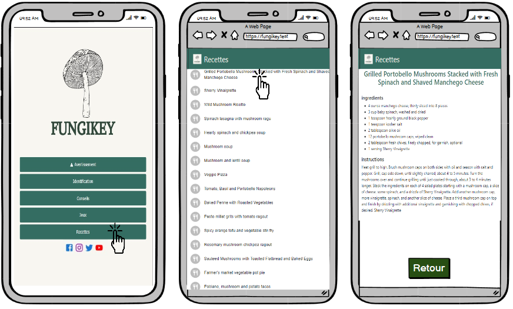

 et son diagramme de sequence est donc comme suit :

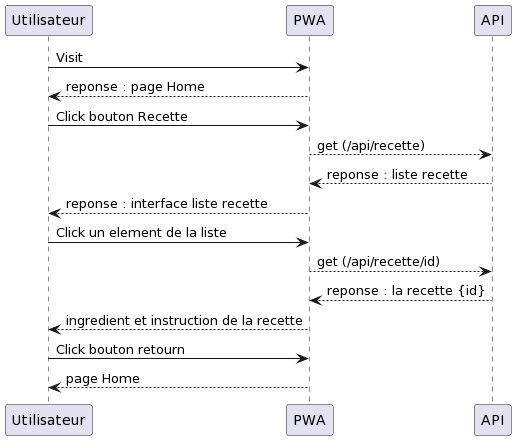

- Quatrième feature: Reseaux sociaux : 

Amélioration de la page Home en ajoutant nos reseaux sociaux

image::design.png[]

- Diagramme de classe de la release:

image::diagramme_1.png[]

=== Api ===

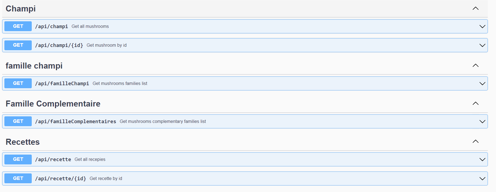
